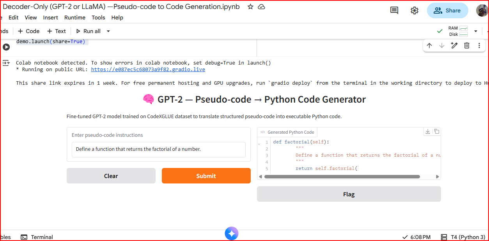
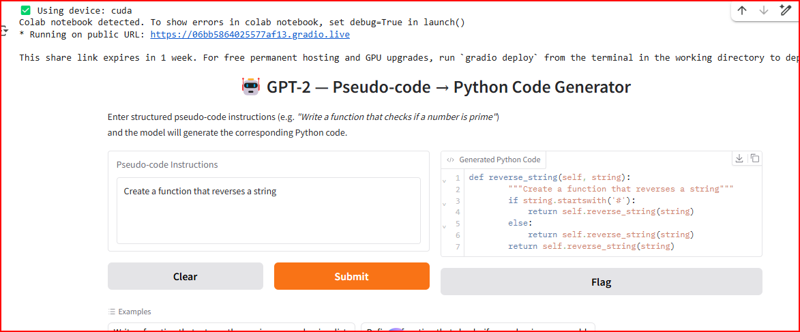

# 🤖 Decoder-Only (GPT-2) — Pseudo-code → Python Code Generation  
> *“Teaching Machines to Think in Code.”*  

---

## 🎯 Project Overview

This project is part of the **Fine-Tuning Transformer Architectures for Real-Time NLP Applications** series.  
It focuses on applying a **Decoder-Only Transformer (GPT-2)** model to translate structured **pseudo-code instructions** into **executable Python programs**.  

By bridging natural language and code, this work demonstrates how large language models can automate software logic generation — a step toward AI-assisted programming.

---

## 🧩 Problem Statement

> **Generate executable Python code from structured pseudo-code instructions.**

The model learns to understand human-readable algorithmic steps and convert them into syntactically and semantically valid Python functions.  

---

## 🧠 Research & Dataset

| Component | Details |
|------------|----------|
| **Dataset** | [SPoC — Pseudo-Code to Code Dataset](https://github.com/sumith1896/spoc) |
| **Research Paper** | [SPoC: A Dataset for Pseudo-code to Code Translation (arXiv:1906.04908)](https://arxiv.org/pdf/1906.04908) |
| **Architecture** | Decoder-Only Transformer (GPT-2) |
| **Framework** | Hugging Face Transformers + PyTorch |
| **Task Type** | Code Generation (Causal Language Modeling Objective) |
| **Interface** | Gradio App for Real-Time Interaction |

---

## 🧰 Methodology

1. **Dataset Preprocessing**  
   - Loaded pseudo-code and corresponding Python code pairs.  
   - Cleaned and tokenized using `GPT2Tokenizer`.  

2. **Model Preparation**  
   - Used `GPT2LMHeadModel` as the base architecture.  
   - Fine-tuned with the causal language modeling objective.  

3. **Training Setup**  
   - Epochs: 1 (quick prototype run)  
   - Batch Size: 2  
   - Learning Rate: 5e-5  
   - Device: NVIDIA T4 GPU (Google Colab)  

4. **Evaluation Metrics**  
   - **BLEU Score:** 20.36  
   - **CodeBLEU:** ≈ 23.10  
   - Qualitative human evaluation of generated code snippets.  

5. **Deployment**  
   - Implemented an interactive **Gradio UI** for real-time pseudo-code → Python conversion.

---

## 🧪 Results

| Metric | Score |
|:-------|:------|
| **BLEU Score** | **20.36** |
| **CodeBLEU Score** | **≈ 23.1** |

> ✅ These scores indicate that the model successfully learns structural and semantic patterns of Python code from pseudo-code descriptions.

---

## 🖼️ Output Screenshots

All output images are available in the `/outputs/` folder:

| Sample 1 | Sample 2 |
|-----------|-----------|
|  |  |
| **Sample 3** | |
|  | |

---

## 💻 Example Generations

| 🧠 Pseudo-Code Input | 💻 Generated Python Code |
|----------------------|-------------------------|
| *Write a function that returns the maximum number in a list.* | ```python\ndef max_in_list(lst):\n    return max(lst)``` |
| *Define a function that checks if a number is prime.* | ```python\ndef is_prime(n):\n    if n < 2:\n        return False\n    for i in range(2, int(n ** 0.5) + 1):\n        if n % i == 0:\n            return False\n    return True``` |
| *Create a function that reverses a string.* | ```python\ndef reverse_string(s):\n    return s[::-1]``` |
| *Write a function that counts vowels in a string.* | ```python\ndef count_vowels(s):\n    return sum(1 for c in s if c.lower() in 'aeiou')``` |
| *Generate a function that prints Fibonacci numbers up to N.* | ```python\ndef fibonacci(n):\n    a, b = 0, 1\n    while a < n:\n        print(a)\n        a, b = b, a + b``` |

---

## 🖥️ How to Run

```bash
# 1️⃣ Clone the repository
git clone https://github.com/deviljerry/FAST-NUCES-work.git

# 2️⃣ Navigate to this task directory
cd "Semester 7/CS4063 Natural Language Processing/Decoder-Only (GPT-2) — Pseudo-code to Code Generation"

# 3️⃣ Install dependencies
pip install -r requirements.txt

# 4️⃣ Launch the Gradio app
python app.py
